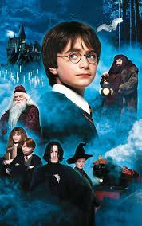

# UC10-GIT

<h1>Participantes do Projeto:</h1>
<h2>Larissa Neitzke</h2>

"Harry Potter e a Pedra Filosofal" é o primeiro livro da série de fantasia escrita por J.K. Rowling, publicado no Brasil pela editora Rocco em 2000. O enredo acompanha Harry Potter, um menino órfão que descobre ser um bruxo no seu 11º aniversário e é convidado para estudar na escola de magia de Hogwarts, onde faz amigos como Ron e Hermione e se aventura para proteger a Pedra Filosofal do Lorde Voldemort. A história também foi adaptada para um filme lançado em 2001.

<a href="https://pt.wikipedia.org/wiki/Harry_Potter_e_a_Pedra_Filosofal_(filme)">Wikipedia Sobre o Filme.</a>
